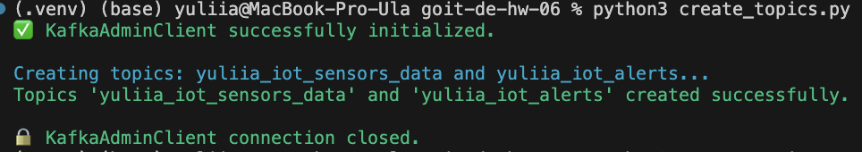
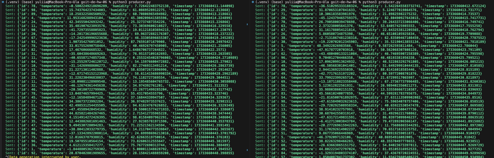
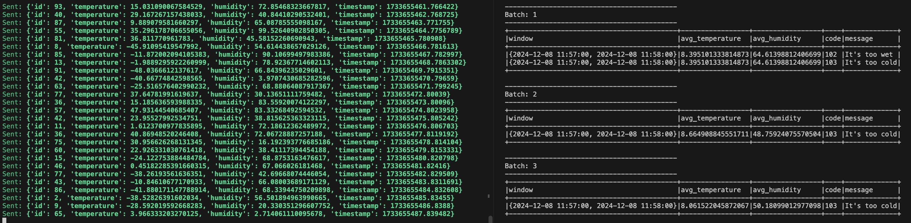

# Домашнє завдання до теми «Spark streaming»

Вітаю! Як настрiй? Сподiваюсь, що ви з нетерпiнням очікуєте на новий челендж 😉

Ласкаво прошу до домашнього завдання, виконавши яке, ви зможете вдосконалити
свої навички практичного застосування Apache Kafka.

Завдання є схожим на те, що було в попередній темі, але набагато цікавіше! 😊

Сьогодні ви будете виконувати типове завдання для моніторингу значень даних ІoТ
приладів.

У цьому домашньому завданні вам необхідно для потоку даних з Kafka-топіку, що
генерується сенсорами, створити програму, що буде аналізувати дані та записувати
алерти в alert-Kafka-топік за виконання певних умов.

> [!NOTE]
>
> 👓 Алерт — від англійського слова alert — тривога. Дані, що виходять за межі
> допустимих значень, називаються алертами. Наприклад, коли температура чи
> вологість виходять за допустимі значення.

## Покрокова інструкція виконання

#### 1. Генерація потоку даних:

Вхідні дані — це дані з Kafka-топіку, такі самі, як і в попередньому домашньому
завданні. Згенеруйте потік даних, що містить `id`, `temperature`, `humidity`,
`timestamp` . Можна використати раніше написаний вами скрипт та топік.

#### 2. Агрегація даних:

Зчитайте потік даних, що ви згенерували в першому пункті. За допомогою Sliding
window, що має довжину 1 хвилину, sliding_interval — 30 секунд, та watermark
duration — 10 секунд, знайдіть середню температуру та вологість.

#### 3. Знайомство з параметрами алертів:

Ваш начальник любить змінювати критерії алертів. Тому, щоб деплоїти код кожного
разу, параметри алертів вказані в файлі:

alerts_conditions.csv

Файл містить максимальні та мінімальні значення для температури й вологості,
повідомлення та код алерту. Значення `-999,-999` вказують, що вони не
використовується для цього алерту.

Подивіться на дані в файлі. Вони мають бути інтуїтивно зрозумілі. Ви маєте
зчитати дані з файлу та використати для налаштування алертів.

#### 4. Побудова визначення алертів:

Після того, як ви знайшли середні значення, необхідно встановити, чи підпадають
вони під критерії у файлі (підказка: виконайте cross join та фільтрацію).

#### 5. Запис даних у Kafka-топік:

Отримані алерти запишіть у вихідний Kafka-топік.

## Критерії прийняття та оцінювання ДЗ

> [!TIP]
>
> ☝🏻 Критерії прийняття домашнього завдання є обов’язковою умовою розгляду
> домашнього завдання ментором. Якщо якийсь з критеріїв не виконано, ДЗ
> відправляється ментором на доопрацювання без оцінювання. Якщо вам «тільки
> уточнити»😉 або ви «застопорилися» на якомусь з етапів виконання — звертайтеся
> до ментора у Slack).

1. Генерація даних сенсорів.

2. Знаходження середніх значень показників.

3. Побудова фільтраційного механізму, що визначить, які записи є алертами.

4. Запис даних у Kafka-топік.

### Формат оцінювання — залік/незалік.

Студент отримує оцінку «залік» за умов виконання всіх вищезазначених критеріїв
прийняття на базовому рівні.

## Підготовка та завантаження домашнього завдання

1. Створіть публічний репозиторій `goit-de-hw-06`.

2. Виконайте завдання та відправте у свій репозиторій скриншоти виконання для
   кожного з етапів у текстовому документі з коротким описом виконання завдання.

Перелік необхідних скриншотів:

- скрин генерації даних сенсорів та відправки даних в `building_sensors` з
  демонстрацією двох (або більше) одночасних роботи двох запусків програми;

- скрин з демонстрацією того, що відфільтровані дані були послані у відповідні
  топіки.

3. Створіть один архів, що містить весь код виконання завдання, та та текстовий
   документ із скриншотами, прикріпіть його в LMS. Назва архіву повинна бути у
   форматі ДЗ6\*ПІБ.

4. Прикріпіть посилання на репозиторій `goit-de-hw-06` та відправте на
   перевірку.

## Формат здачі

- Посилання на репозиторій `goit-de-hw-06`.
- Прикріплений архів із назвою ДЗ6_ПІБ.

### Результати виконаних завданнь

